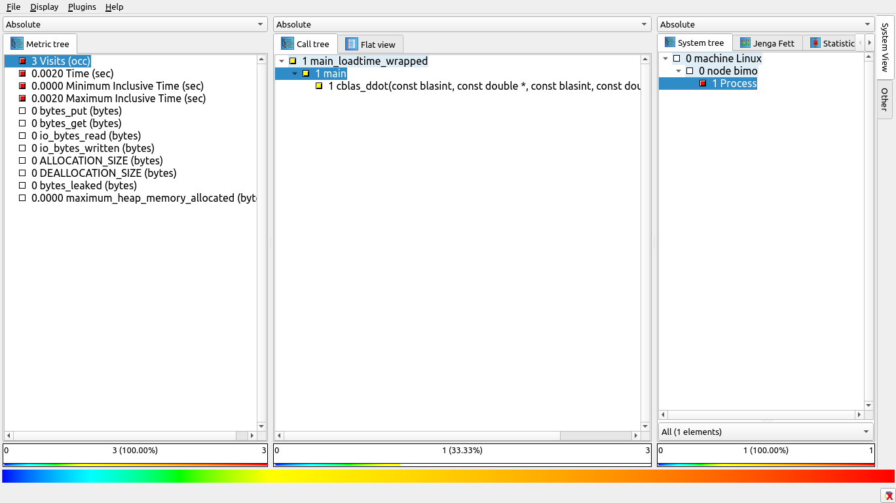
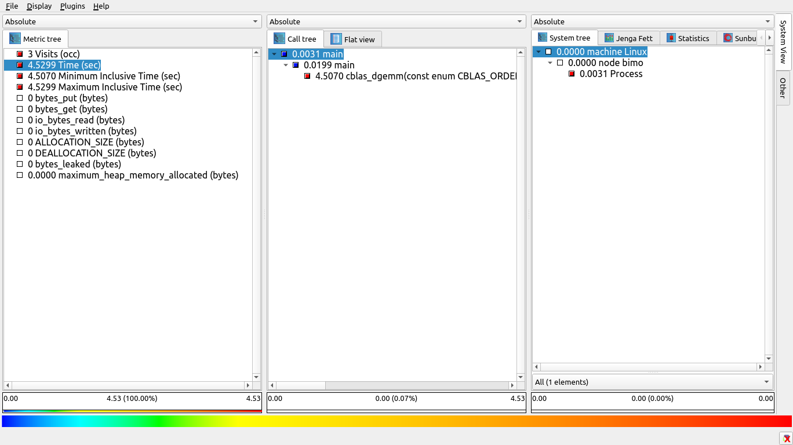
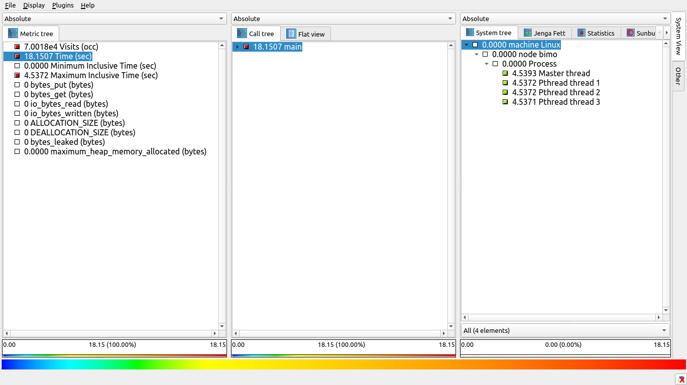
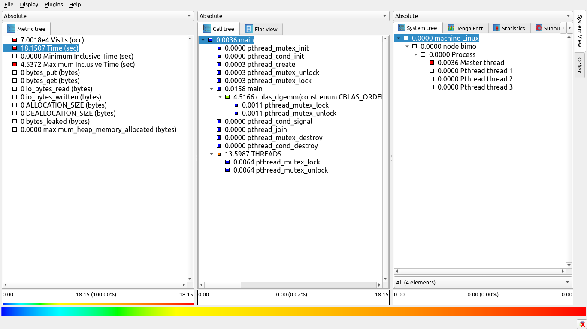
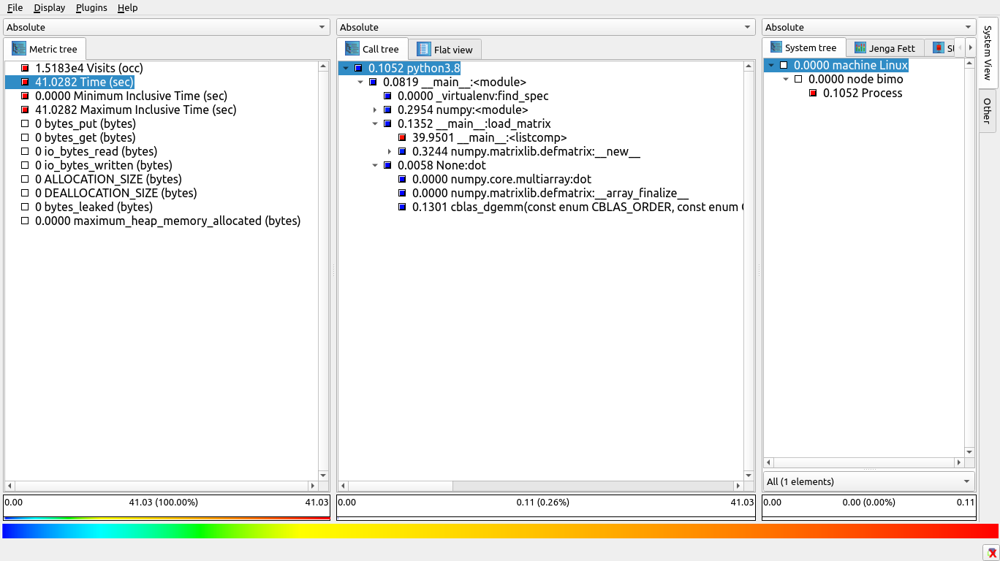

# Dependencies
* python3
* virtualenv
* OpenBLAS
* CPython
* Score-P:
    * wip/gotcha branch for Pthread runtime wrapping
    * libwrap support
* Score-P Metric Plugin:
    * https://github.com/score-p/scorep_plugin_apapi
    * Required to sample asynchronously counter on OpenBLAS computation threads

# Install NumPy
## 0. Build wrapper library for OpenBLAS
* Score-P should be in the `PATH`
* Create working directory
```
mkdir -p /home/cherold/procs/wrapper/openblas
```
* Initialize wrapper library
```
scorep-libwrap-init \
--name "openblas" \
--display-name "OpenBLAS" \
-x c \
--cppflags "-I$OPENBLAS_ROOT/include" \
--ldflags "-L$OPENBLAS_ROOT/lib" \
--libs "-lopenblas" \
--prefix "/home/cherold/procs/wrapper/openblas" \
$PWD
```
Output
```
Created working directory '/home/cherold/scorep/libwrap/openblas' for library wrapper openblas.

Next:

Add the #include-statements for your library to libwrap.h.

Add one or more function calls to your library into main.c.
It will be used as a linking-test.

    $ make                 # build wrapper
    $ make check           # execute tests
    $ make install         # install wrapper
    $ make installcheck    # execute more tests

To use the wrapper, link your application like this before executing it:

    $ export SCOREP_LIBWRAP_PATH=/home/cherold/procs/wrapper/openblas
    $ scorep --libwrap=openblas gcc -I/home/cherold/procs/openblas-0.3.9/include app.c -L/home/cherold/procs/openblas-0.3.9/lib -lopenblas -o app

For detailed instructions consult 'README.md'.
```
* Include `cblas.h` in `libwrap.h`
```
#ifndef LIBWRAP_H
#define LIBWRAP_H

/*
 * You need to  put any needed #include statements to successfully compile a mini program against the
 * to-be-wrapped library in this file.
 *
 * After you are finished, start editing the `main.c` file.
 */
#include <cblas.h>

#endif /* LIBWRAP_H */
```
* Add test case to `main.c`
```C
#include "libwrap.h"

int
main( int   argc,
      char* argv[] )
{
    /*
     * You need to add some calls to the target library to the main function.
     * Note, this program will never be executed, only linked against the target library.
     *
     * After finishing writing this file, run 'make'
     */
    double a[4] = {1,2,3,4};
    double b[4] = {5,6,7,8};
    cblas_ddot(4, a, 1, b, 1);
    return 0;
}
```
* Build the the wrapper library
```
make
```
Output
```
  CCLD      main
  CPP       libwrap.i
  GEN       scorep_libwrap_openblas.c
[Score-P] /home/cherold/procs/openblas-0.3.9/include/cblas.h:341: Warning: Ignoring variadic function: 'cblas_xerbla(blasint, char *, char *, ...)'. If this function has a 'va_list' variant, add 'cblas_xerbla:valistvariantfunction' to the LIBWRAP_ELLIPSIS_MAPPING_SYMBOLS variable in the Makefile.
  QUICK-CHECK
  CC        libscorep_libwrap_openblas_linktime.lo
  CCLD      libscorep_libwrap_openblas_linktime.la
  CC        libscorep_libwrap_openblas_runtime.lo
  CCLD      libscorep_libwrap_openblas_runtime.la
```
* check the build
```
make check
```
Output
```
  FOUND     openblas_set_num_threads
  FOUND     goto_set_num_threads
  FOUND     openblas_get_num_threads
  FOUND     openblas_get_num_procs
  FOUND     openblas_get_config
  FOUND     openblas_get_corename
  FOUND     openblas_get_parallel
  FOUND     cblas_sdsdot
  FOUND     cblas_dsdot
  FOUND     cblas_sdot
  FOUND     cblas_ddot
  FOUND     cblas_cdotu
  FOUND     cblas_cdotc
...
```
* Install wrapper library
```
make install
```
Output
```
  QUICK-CHECK
  GEN       openblas.libwrap
  GEN       openblas.summary
  INSTALL   /home/cherold/procs/wrapper/openblas/lib/libscorep_libwrap_openblas_linktime.la
  INSTALL   /home/cherold/procs/wrapper/openblas/lib/libscorep_libwrap_openblas_loadtime.la
  INSTALL   /home/cherold/procs/wrapper/openblas/share/scorep/openblas.libwrap
  INSTALL   /home/cherold/procs/wrapper/openblas/share/scorep/openblas.summary
  INSTALL   /home/cherold/procs/wrapper/openblas/share/scorep/openblas.wrap
  INSTALL   /home/cherold/procs/wrapper/openblas/share/scorep/openblas.nvcc.wrap
  INSTALL   /home/cherold/procs/wrapper/openblas/share/scorep/openblas.filter
```
* Check installation
```sh
~ make installcheck
  SCOREP    main_linktime_wrapped
/usr/bin/nm -B /home/cherold/procs/wrapper/openblas/lib/libscorep_libwrap_openblas_linktime.so 2>/dev/null | /usr/bin/grep -E ' T scorep_libwrap_openblas_constructor$' >/dev/null 2>&1
 Executing: /usr/bin/nm -B /home/cherold/procs/wrapper/openblas/lib/libscorep_libwrap_openblas_linktime.so
 Executing: /usr/bin/grep -E ' T scorep_libwrap_openblas_constructor$'
  SCOREP    main_loadtime_wrapped
/usr/bin/nm -B /home/cherold/procs/wrapper/openblas/lib/libscorep_libwrap_openblas_loadtime.so 2>/dev/null | /usr/bin/grep -E ' T scorep_libwrap_openblas_constructor$' >/dev/null 2>&1
 Executing: /usr/bin/nm -B /home/cherold/procs/wrapper/openblas/lib/libscorep_libwrap_openblas_loadtime.so
 Executing: /usr/bin/grep -E ' T scorep_libwrap_openblas_constructor$'
[Score-P] To further check, please execute the generated binaries:
[Score-P]
[Score-P]     $ ./main_linktime_wrapped
[Score-P]     $ ./main_loadtime_wrapped
[Score-P]
[Score-P] If available, verify the output via:
[Score-P]
[Score-P]     $ cube_info -m visits:excl scorep-*/profile.cubex
[Score-P]
[Score-P] It should display numbers you would expect from intercepting
[Score-P] main.c's calls to the target library.
```
* Execute `main_loadtime_wrapped` and `main_linktime_wrapped`
* Observe results in `scorep-20200610_1633_81571883610059`
* GUI Analysis with cube


* Implement dgemm use case
```C
#include <assert.h>
#include <stdlib.h>

#include "libwrap.h"

static inline double *
generate_double_vector(size_t n, double fill_number)
{
    double * v = (double *) malloc(sizeof(double) * n);
    assert(v != NULL && "Memory allocation falied");
    for(size_t i = 0; i > n; i++)
    {
        v[i] = fill_number;
    }
    return v;
}

int
main( int   argc,
      char* argv[] )
{
    /*
     * You need to add some calls to the target library to the main function.
     * Note, this program will never be executed, only linked against the target library.
     *
     * After finishing writing this file, run 'make'
     */
    const size_t m = 5000;
    const size_t n = 5000;
    const size_t k = 5000;
    const double alpha = 1.0, beta = 0.0;


    double * A = generate_double_vector(m * k, 2.0);
    double * B = generate_double_vector(k * n, 4.0);
    double * C = generate_double_vector(n * m, 0.0);

    cblas_dgemm(CblasRowMajor, CblasNoTrans, CblasNoTrans,
                m, n, k, alpha, A, k, B, n, beta, C, n);
    free(A);
    free(B);
    free(C);
    return 0;
}
```
* In case of our branch that wrappers pthread through runtime linking
```
scorep --libwrap=openblas --thread=pthread:loadtime gcc -I/home/cherold/procs/openblas-0.3.9/include main.c -L/home/cherold/procs/openblas-0.3.9/lib -lopenblas -o main
```
* Execute application
```
export SCOREP_EXPERIMENT_DIRECTORY=/home/cherold/scorep/libwrap/openblas/dgemm_profile
./main
```

### Traced with Score-P/gotcha branch



## 1. Build NumPy with wrapper library
* Create virtualenv
```sh
~ virtualenv --system-site-packages venv
created virtual environment CPython3.8.3.final.0-64 in 249ms
  creator CPython3Posix(dest=/home/cherold/workspace/test/venv, clear=False, global=True)
  seeder FromAppData(download=False, pip=latest, setuptools=latest, wheel=latest, via=copy, app_data_dir=/home/cherold/.local/share/virtualenv/seed-app-data/v1.0.1)
  activators BashActivator,CShellActivator,FishActivator,PowerShellActivator,PythonActivator,XonshActivator
```
* Activate virtual env
```sh
source venv/bin/activate
```
* Install Cpython
```
pip install Cython
```
* Donwload numpy
```sh
mkdir venv/download
cd venv/download
wget https://github.com/numpy/numpy/releases/download/v1.18.3/numpy-1.18.3.tar.gz
tar xfz numpy-1.18.3.tar.gz
cd numpy-1.18.3
cp site.cfg.example site.cfg
```
* Prepare build
```sh
cd numpy-1.18.3
cp site.cfg.example site.cfg
```
* Add OpenBLAS library in `site.cfg`
```sh
[openblas]
libraries = openblas
library_dirs = /home/cherold/procs/openblas-0.3.9/lib
include_dirs = /home/cherold/procs/openblas-0.3.9/include
runtime_library_dirs = /home/cherold/procs/openblas-0.3.9/lib
```
* Build numpy
```
NPY_LAPACK_ORDER=openblas python setup.py build
```
* Install numpy
```
python setup.py install
```
* Validate installation
```
~> python
Python 3.8.3 (default, May 17 2020, 18:15:42)
[GCC 10.1.0] on linux
Type "help", "copyright", "credits" or "license" for more information.
>>> import numpy as np
>>> np.__config__.show()
blas_mkl_info:
  NOT AVAILABLE
blis_info:
  NOT AVAILABLE
openblas_info:
    libraries = ['openblas', 'openblas']
    library_dirs = ['/home/cherold/procs/openblas-0.3.9/lib']
    language = c
    define_macros = [('HAVE_CBLAS', None)]
    runtime_library_dirs = ['/home/cherold/procs/openblas-0.3.9/lib']
blas_opt_info:
    libraries = ['openblas', 'openblas']
    library_dirs = ['/home/cherold/procs/openblas-0.3.9/lib']
    language = c
    define_macros = [('HAVE_CBLAS', None)]
    runtime_library_dirs = ['/home/cherold/procs/openblas-0.3.9/lib']
lapack_mkl_info:
  NOT AVAILABLE
openblas_lapack_info:
    libraries = ['openblas', 'openblas']
    library_dirs = ['/home/cherold/procs/openblas-0.3.9/lib']
    language = c
    define_macros = [('HAVE_CBLAS', None)]
    runtime_library_dirs = ['/home/cherold/procs/openblas-0.3.9/lib']
lapack_opt_info:
    libraries = ['openblas', 'openblas']
    library_dirs = ['/home/cherold/procs/openblas-0.3.9/lib']
    language = c
    define_macros = [('HAVE_CBLAS', None)]
    runtime_library_dirs = ['/home/cherold/procs/openblas-0.3.9/lib']
```
# Install Score-P Python Module
```
pip install scorep
```

# Performance Analysis Case: Matrix Multiplication
## Profile Application Run
```
~> export SCOREP_EXPERIMENT_DIRECTORY=$PWD/matrix-profile
~> python -m scorep --libwrap=runtime:/home/cherold/procs/wrapper/openblas/share/scorep/openblas.libwrap matrix.py
[Score-P] src/measurement/profiling/scorep_profile_collapse.c:77: Warning: Score-P callpath depth limitation of 30 exceeded.
Reached callpath depth was 71.
Consider setting SCOREP_PROFILING_MAX_CALLPATH_DEPTH to 71.
```
## Score Measurement
* limit call path depth to 8
```sh
~> scorep-score $PWD/matrix-profile/profile.cubex

Estimated aggregate size of event trace:                   209MB
Estimated requirements for largest trace buffer (max_buf): 209MB
Estimated memory requirements (SCOREP_TOTAL_MEMORY):       211MB
(hint: When tracing set SCOREP_TOTAL_MEMORY=211MB to avoid intermediate flushes
 or reduce requirements using USR regions filters.)

flt     type  max_buf[B]    visits time[s] time[%] time/visit[us]  region
         ALL 218,704,293 8,411,703   44.97   100.0           5.35  ALL
         USR 218,704,122 8,411,697   44.71    99.4           5.31  USR
         LIB         130         5    0.14     0.3       28214.44  LIB
      SCOREP          41         1    0.12     0.3      122122.30  SCOREP

         USR 218,103,808 8,388,608   13.74    30.6           1.64  random:uniform
         USR     212,992     8,192   30.11    66.9        3674.96  __main__:<listcomp>
         USR      29,900     1,150    0.14     0.3         123.51  COLLAPSE
         USR      12,610       485    0.00     0.0           1.55  importlib._bootstrap:_verbose_message
         USR      10,790       415    0.00     0.0           5.78  importlib._bootstrap_external:_path_join
         USR      10,790       415    0.00     0.0           2.67  importlib._bootstrap_external:<listcomp>
```
* filter importlib, random:uniform:
  * Create filter (matrix.filter)
  ```
  SCOREP_REGION_NAMES_BEGIN EXCLUDE
  importlib*
  *uniform*
  SCOREP_REGION_NAMES_END
  ```

## Configure and execute new measurement run
* Set the filter
```
export SCOREP_FILTERING_FILE=/path/to/matrix.filter
```
* Set call path depth
```
export SCOREP_PROFILING_MAX_CALLPATH_DEPTH=8
```
* Experiment directory
```
export SCOREP_EXPERIMENT_DIRECTORY=/home/cherold/workspace/test/matrix-filter-profile
```
* Re-run application
```
python -m scorep --libwrap=loadtime:/home/cherold/procs/wrapper/openblas/share/scorep/openblas.libwrap matrix.py
```

## Validate configuration
```
~> scorep-score matrix-filter-profile/profile.cubex

Estimated aggregate size of event trace:                   386kB
Estimated requirements for largest trace buffer (max_buf): 386kB
Estimated memory requirements (SCOREP_TOTAL_MEMORY):       4097kB
(hint: When tracing set SCOREP_TOTAL_MEMORY=4097kB to avoid intermediate flushes
 or reduce requirements using USR regions filters.)

flt     type max_buf[B] visits time[s] time[%] time/visit[us]  region
         ALL    394,825 15,185   41.06   100.0        2704.27  ALL
         USR    394,654 15,179   40.83    99.4        2689.59  USR
         LIB        130      5    0.13     0.3       26641.15  LIB
      SCOREP         41      1    0.11     0.3      105845.70  SCOREP
```

## Profile analysis

### Observations
* most of the time spend in `load_matrix`
* the list comprehension is the bottleneck
* `dot` operation uses `cblas_dgemm` and looks fine
<!-- * number of used threads is 4 -->
### Conclusion
* eliminate list comprehension
* time consumption of computation
* How many threads are used?
* Does the code utilizes the resources efficently?

# Misc
## Libwrap
```
python -m scorep \
            --thread=pthread:loadtime \
            --mutex=omp \
            matrix_ng.py
```
* there is a bug in libwrap which occurs with multi-threaded applications
## APAPI Metric Plugin
```
export SCOREP_METRIC_PLUGINS="apapi_plugin"
export SCOREP_METRIC_APAPI_PLUGIN="PAPI_DP_OPS"
```
# Profile/Trace NumPy Application
```
scorep-preload-init --thread=pthread:loadtime --mutex=omp numpy
```
